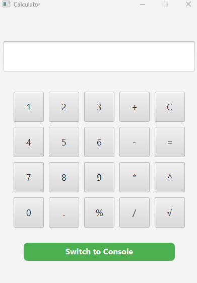
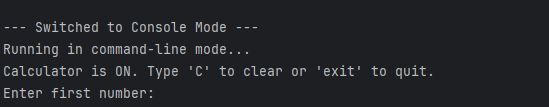

# 🔢SmartCalc

---
> Όλες οι βασικές αλλα και επιστημονικές λειτουργίες που χρειάζεσαι , σε ένα απλο περιβάλλον.
> 
To **SmartCalc** είναι ένα επιστημονικό κομπιουτεράκι γραμμένο στην **Java**.Είναι σχεδιασμένο ώστε να είναι γρήγορο , 
αξίοπιστο και εύκολο στην χρήση για κάθε χρήστη.
---
# ✨Λειτουργίες
* **Πρόσθεση**
* **Αφαίρεση**
* **Πολλαπλασιασμός**
* **Εκθέτης / Δύναμη**
* **Τετραγωνική Ρίζα**
* **Ποσοστό**
---
# 📚Εγχειρίδιο χρήσης
<p align="center">


* **Εισαγωγή Πρώτου Αριθμού:** Πληκτρολογήστε τον πρώτο αριθμό χρησιμοποιώντας τα πλήκτρα **0-9** και την **υποδιαστολή** (`.`).
* **Επιλογή Πράξης:** Επιλέξτε την πράξη που θέλετε να εκτελέσετε.
* **Εισαγωγή Δεύτερου Αριθμού:** Πληκτρολογήστε τον δεύτερο αριθμό χρησιμοποιώντας τα πλήκτρα **0-9** και την **υποδιαστολή** (`.`).
* **Υπολογισμος:** Πατήστε το κουμπί (`=`) για να δείτε το τελικό αποτέλεσμα.
### 🔬Ειδικές Λειτουργίες:

* **Τετραγωνική Ρίζα ($\sqrt{}$):** Πληκτρολογήστε τον αριθμό και, στη συνέχεια, πατήστε το πλήκτρο της **Τετραγωνικής Ρίζας**.

### ⌨️Λειτουργία Κονσόλας: 
* Αν θέλετε να χρησιμοποιήσετε το πρόγραμμα σε λειτουργία κονσόλας, υπάρχει ένα **ειδικό κουμπί** (**Switch to console**) στην εφαρμογή που μπορείτε να πατήσετε.

  
  
### Χρήση Κονσόλας
* Αφού πατήσετε το κούμπι θα εμφανιστεί η κονσόλα στην οθόνη σας.

* Δουλέυετε ομοίως χρησιμοποιόντας το πληκτρολόγιο σας , με τις μόνες διαφορές να είναι οι εξής:


```bash
# Για καθαρισμό πληκτρολογήστε:
'C'
# Για έξοδο πληκτρολογήστε:
'exit'
```
---
#  ‍💼Project Manager
* [@nikosxrist](https://github.com/nikosxrist)
# 🤝 Συμμετέχοντες
* [@Far0yk](https://github.com/Far0yk)
* [@EvriZapt](https://github.com/EvriZapt)
* [@drmqwerty](https://github.com/drmqwerty)
* [@ThodorisT30](https://github.com/ThodorisT30)
* [@kobas2310](https://github.com/kobas2310)